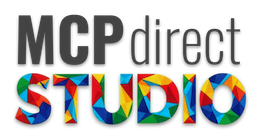
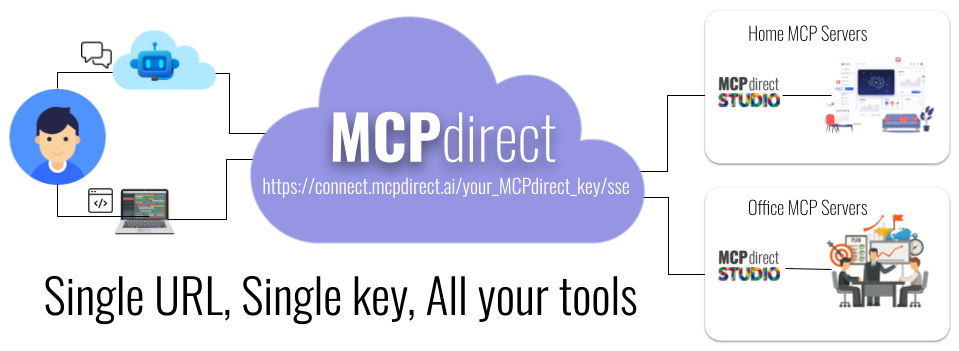

# MCPdirect: Connect your MCP servers anywhere directly to AI agents worldwide

## Quick Start

### Prepare
1.  Download MCPdirect Studio App from [Release Page](https://github.com/mcpdirect/mcpdirect-studio-ui-kmp/releases/tag/pre-release) 
2.  Anonymous sign in

### Three steps to Enable Any Agent to Securely Connect to Your MCP Servers

1.  **Add a MCP Server:** In the MCPdirect Studio App, add your local or cloud-based MCP server and publish it to MCPdirect.
2.  **Create a Key:** Generate a secure key for the AI Agent and copy the generated configuration.
3.  **Configure the Agent:** Paste the copied configuration into your Agent's MCP server settings.

### Config in AI Agent
- [ https://space.coze.cn](https://space.coze.cn/)
- [</img> (macOS) https://qwen.ai/download](https://qwen.ai/download) 
- [ https://yuanqi.tencent.com/](https://yuanqi.tencent.com/) 
- [ https://cloud.dify.ai/](https://cloud.dify.ai/)
- [ https://claude.ai/download](https://claude.ai/download)
---

## Overview

## Features

* **Connect MCP:** The core feature of the application, allowing users to add, monitor, and manage MCP servers. It supports both "stdio" and "sse" server types.
* **Agent Keys:** Manage API keys for connecting to MCP servers. Users can generate, view, enable/disable, and revoke keys.
* **Tool Permission:** Fine-grained permission control for each API key, allowing users to specify which tools a key can access.
* **Multi-Device Support:** A single key can be used to connect and authenticate from multiple different devices or AI agents simultaneously.
* **Tools Logbook:** Logs the usage of various tools, providing insights from both "manufacturer" and "agent" perspectives.
* **Settings:**
    * Customize device information such as name and tags.
    * Manage your account, including password changes and logout.
* **DIY Tools:** (Coming Soon) This feature is currently under development.

## Getting Started with Development

### Prerequisites

* Java Development Kit (JDK) 17 or later.

### Installation & Running the App from Source

1.  Clone the repository to your local machine.
2.  Open a terminal or command prompt in the project's root directory.
3.  Run the application using the Gradle wrapper:
    * On Windows: `gradlew.bat run`
    * On macOS/Linux: `./gradlew run`

## Technology Stack

* **Language:** Kotlin
* **UI Framework:** Jetpack Compose for Desktop

## Roadmap

* Implementation of the "DIY Tools" feature.
* ...
* ...

## Contributing

## License

